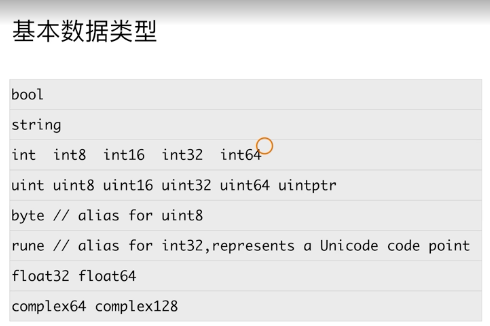

# go语言中的数据类型



和其他编程语言的差异：

- go语言中不允许有隐式类型转换
- 别名和原有类型也不能进行隐式类型转换

## go语言中的默认常量

```go
func TestMath(t *testing.T) {
	t.Log(math.MaxInt)
	t.Log(math.MaxFloat64)
	t.Log(math.MaxFloat32)
	// ...
}
```

## go语言数据类型与其他语言的主要差别

- go语言中的指针类型不支持指针的计算

  ```go
  func TestPoint(t *testing.T) {
  	a := 1
  	aPoint := &a

  	// aPoint += 1  // 不支持指针运算
  	t.Log(a,aPoint)
  	t.Logf("%T,%T", a, aPoint)
  }

  // output
  === RUN   TestPoint
      data_type_test.go:28: 1 0x140000a21a0
      data_type_test.go:29: int,*int
  --- PASS: TestPoint (0.00s)
  ```
- go语言中的字符串类型的默认值是空字符串，而不是nil
