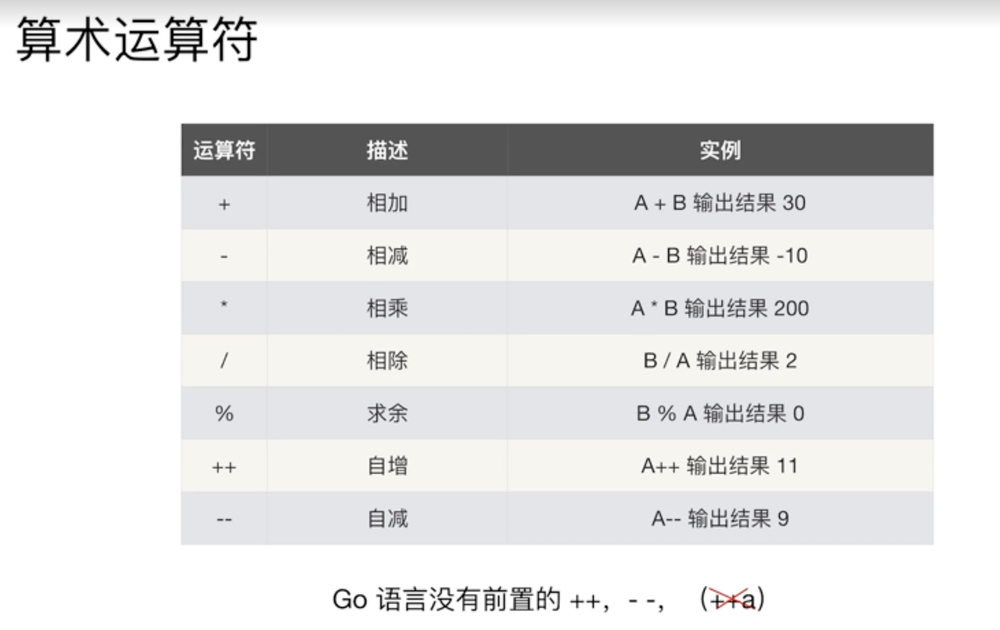
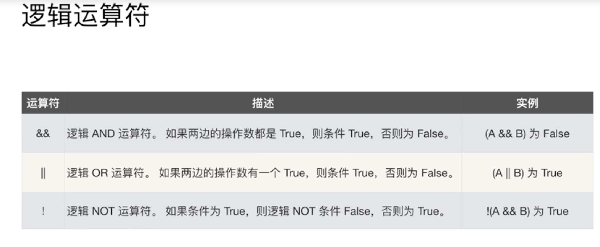
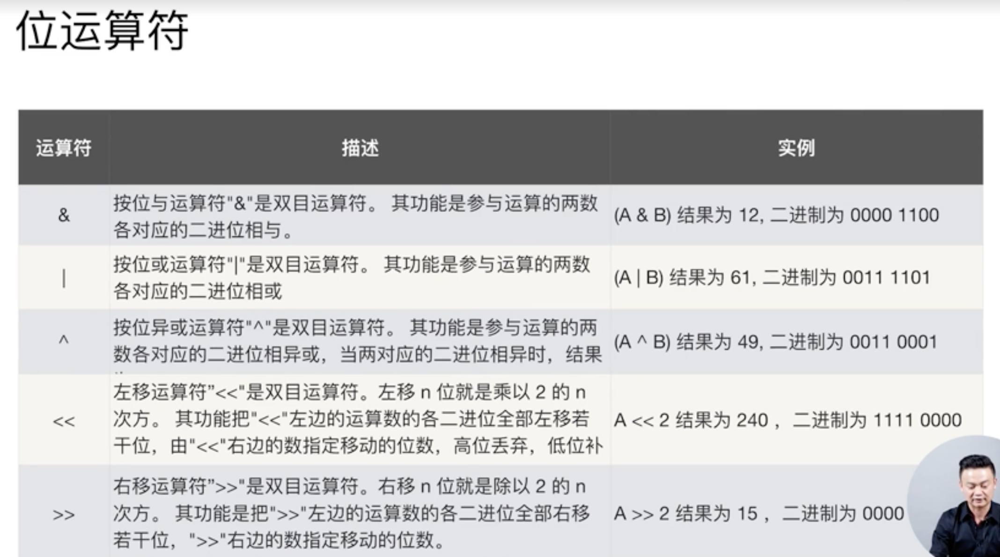

# go语言中的运算符



**go语言中没有前置++，--**

## 用==比较数组相等的条件

- 维数相同，元素个数相同
- 每个元素的值都相同（等于元素的顺序也要相同）

```go
func TestCompareList(t *testing.T) {
	a := [...]int{1, 2, 3, 4}
	b := [...]int{1, 2, 3, 4}
	c := [...]int{1, 4, 2, 3}

	t.Log(a==b)
	t.Log(a==c)
}

// output
=== RUN   TestCompareList
    operator_test.go:10: true
    operator_test.go:11: false
--- PASS: TestCompareList (0.00s)
```

逻辑运算符



位运算符


