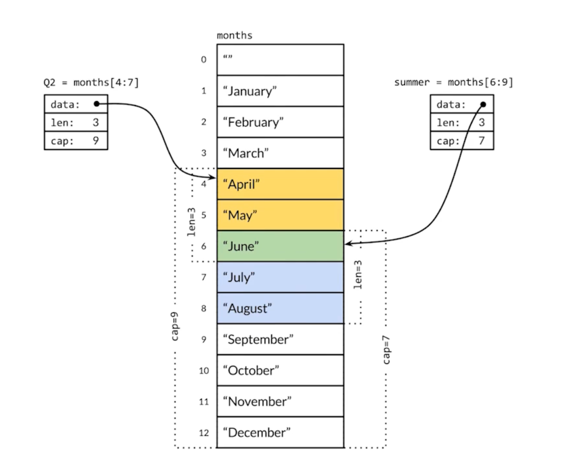

[TOC]

# 数组和切片

## 数组

### 数组的声明

```go
func TestArrayInit(t *testing.T) {
	// 声明数组并赋值
	var a [3]int
	a[1] = 1

	// 声明的同时初始化
	b := [3]int{1, 2, 3}
	d := [...]int{1, 2, 3}
	t.Log(b, d)

	// 多维数组的初始化
	c := [2][2]int{{1, 1}, {2, 2}}
	t.Log(c)
}
```

### 数组的截取

```go
func TestArrayExtract(t *testing.T) {
	arr := [6]int{1, 2, 3, 4, 5, 6}
	t.Log(arr[1])
	t.Log(arr[:2])
	t.Log(arr[2:])
	t.Log(arr[2:5])
}
```

### 数组的遍历

```go
func TestArrayTravel(t *testing.T) {
	arr := [3]int{1, 2, 3}
	for i := 0; i < len(arr); i++ {
		t.Log(arr[i])
	}

	for i, v := range arr {
		t.Log(i, v)
	}
}
```

## 切片

### 切片的声明和初始化

```go
	// 切片的声明和初始化
	s1 := [3]int{1, 2, 3} // 数组
	var s2 []int
	m1 := make([]int, 3, 5) // type,len,cap

```

### 切片的添加元素

> 这添加了元素，返回一个新的切片

```go
s3 := append(s2, 1)
```

### 切片的原理

#### 切片的结构

go语言中切片的底层是一个结构体，它包含三个元素

- len:切片中元素的个数
- cap:切片中内部数组的容量
- ptr:一个指向数组的指针

#### 切片的可变长原理

当使用append添加元素时，如果元素个数len大于cap，切片会创建一个容量为当前cap一倍的新数组，然后将现在数组中的元素拷贝到新数组中，然后将指针指向这个数组。

```go
func TestSlice(t *testing.T) {
	// 切片的声明和初始化
	s1 := [3]int{1, 2, 3} //
	var s2 []int
	m1 := make([]int, 3, 5) // type,len,cap

	t.Logf("array s1: len:%v cap:%v %v", len(s1), cap(s1), s1)
	t.Logf("slice s2: len:%v cap:%v %v", len(s2), cap(s2), s2)
	t.Logf("slice m1: len:%v cap:%v %v", len(m1), cap(m1), m1)

	m2 := append(m1,1)
	t.Log("m1:",m1,len(m1),cap(m1))
	t.Log("m2:",m2,len(m2),cap(m2))

	// 切片增加元素
	s3 := append(s2, 1)
	s4 := append(s3, 1)
	s5 := append(s4, 1)
	s6 := append(s5, 1)
	t.Logf("slice s2: len:%v cap:%v %v %v", len(s2), cap(s2), s2, &s2)
	t.Logf("slice s3: len:%v cap:%v %v %v", len(s3), cap(s3), s3, &s3)
	t.Logf("slice s4: len:%v cap:%v %v %v", len(s4), cap(s4), s4, &s4)
	t.Logf("slice s5: len:%v cap:%v %v %v", len(s5), cap(s5), s5, &s5)
	t.Logf("slice s6: len:%v cap:%v %v %v", len(s6), cap(s6), s6, &s6)

}

```

output

```go

=== RUN   TestSlice
    array_slice_test.go:45: array s1: len:3 cap:3 [1 2 3]
    array_slice_test.go:46: slice s2: len:0 cap:0 []
    array_slice_test.go:47: slice m1: len:3 cap:5 [0 0 0]
    array_slice_test.go:50: m1: [0 0 0] 3 5
    array_slice_test.go:51: m2: [0 0 0 1] 4 5
    array_slice_test.go:58: slice s2: len:0 cap:0 [] &[]
    array_slice_test.go:59: slice s3: len:1 cap:1 [1] &[1]
    array_slice_test.go:60: slice s4: len:2 cap:2 [1 1] &[1 1]
    array_slice_test.go:61: slice s5: len:3 cap:4 [1 1 1] &[1 1 1]
    array_slice_test.go:62: slice s6: len:4 cap:4 [1 1 1 1] &[1 1 1 1]
--- PASS: TestSlice (0.00s)

```

#### 切片共享内部存储结构



> 切片可以共享同一个连续的存储空间

```go
func TestSliceShareMemory(t *testing.T) {
	const (
		Monday = 1 + iota
		Tuesday
		Wednesday
		Thursday
		Friday
		Saturday
		Sunday
	)

	s1 := []int{Monday, Tuesday, Wednesday, Thursday, Friday, Saturday, Sunday}

	t.Logf("s1: cap:%v len:%v", cap(s1), len(s1))

	// s2 和 s3之间有一段内存是共享的，s2/s3和s1之间的内存是完全共享的
	s2 := s1[:4]
	s3 := s1[3:5]
	// 因为cap是从当前截取的位置到容量的末尾位置计算的，所以s3的len为2，cap为4
	t.Logf("s2: cap:%v len:%v", cap(s2), len(s2))
	t.Logf("s3: cap:%v len:%v", cap(s3), len(s3))

	s2[3] = 100

	// s1 , s2 ,s3 all changed because of sharing memory
	t.Log(s1)
	t.Log(s2)
	t.Log(s3)
}
```

### 数组和切片是否可以比较？

- 切片自身是否可以比较？ 不可以，编译错误
- 数组和切片是否可以比较？不可以，编译错误

```go
func TestSliceCompare(t *testing.T) {
	a := []int{1, 2, 3}
	b := []int{1, 2, 3}
	t.Log(b)
	//if a == b { // invalid operation: a == b (slice can only be compared to nil)
	//	t.Log("Equal")
	//}

	c := [...]int{1,2,3}

	//if a == c {  //invalid operation: a == c (mismatched types []int and [3]int)
	//	t.Log("Equal")
	//}

	t.Log(a,c)
}
```
