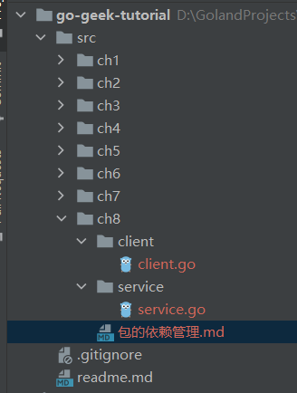
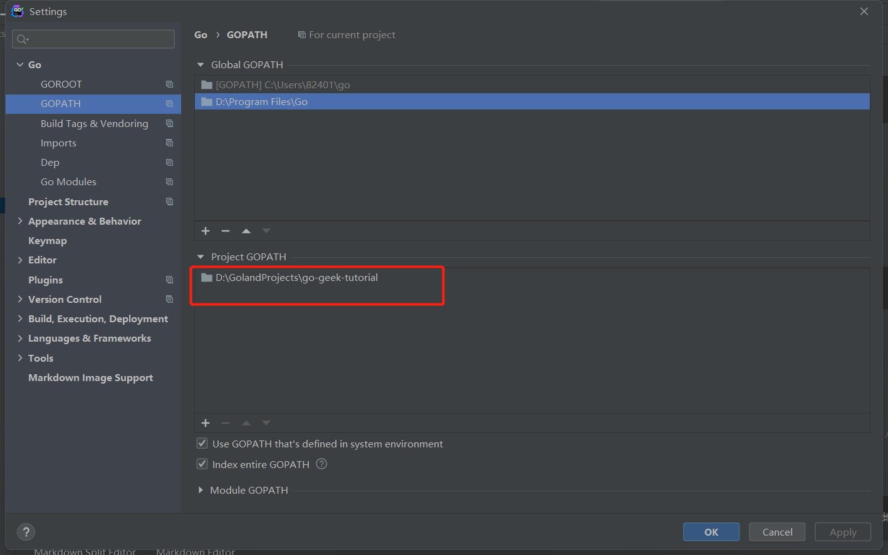

## 包的依赖管理

### package

1.package是go语言中的基本复用单元，以首字母大写来表明这个方法，变量可以被包之外的代码来访问。

2.代码中的package可以和所在目录不一致。

3.同一目录中的Go代码的package要保持一直。

演示：

新建目录结构如下:


service.service.go

```go
package service

func Add(x, y int) int {
	return x + y
}

func subtract(x, y int) int {
	return x - y
}
```

client.client.go

```go
package main

import (
	"ch8/service"
	"fmt"
)

func main() {
	//sub := service.subtract(1,2) // Unexported function 'subtract' usage
	sum := service.Add(1, 2)
	fmt.Println("Sum:", sum)
}
```

注意：
`ch8/service`，因为我们是想从本地将代码包导入过来，所有我们需要设置gopath路径，在goland或者命令行中设置。


### package中的init方法

1.在main方法被执行前，所有依赖的package的init方法都会被执行。

2.不同包的init函数按照包导入的依赖关系决定执行顺序。

3.每个包可以有多个init函数。

4.包的每个源文件也可以有多个init函数，这点比较特殊。

测试：
service.go

```go
package service

import "fmt"

func init() {
	fmt.Println("service init 01")
}

func init() {
	fmt.Println("service init 02")
}

func Add(x, y int) int {
	return x + y
}

func subtract(x, y int) int {
	return x - y
}
```

demo.go

```go
package service

import "fmt"

func init() {
	fmt.Println("demo init 01")
}

func init() {
	fmt.Println("demo init 02")
}
```

client.go

```go
package main

import (
	"ch8/service"
	"fmt"
)

func init() {
	fmt.Println("client init 01")
}

func init() {
	fmt.Println("client init 02")
}

func main() {
	//sub := service.subtract(1,2) // Unexported function 'subtract' usage
	sum := service.Add(1, 2)
	fmt.Println("Sum:", sum)
}
```

输出：
```go
demo init 01
demo init 02
service init 01
service init 02
client init 01
client init 02
Sum: 3
```